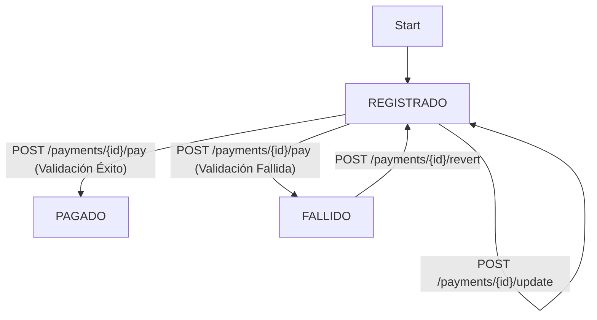

# API de Pagos - Examen Unidad 1

Implementación de una API de gestión de pagos en FastAPI, incluyendo tests, CI/CD y patrones de diseño.

## 1. API en Producción (Live Demo)

* **API Base URL:** `https://examen-mia203-grupo1.onrender.com`
* **Documentación (Swagger):** `https://examen-mia203-grupo1.onrender.com/docs`

---

## 2. Ejecución Local

**a. Instalar dependencias:**
```bash
pip install -r requirements.txt
```

**b. Correr la Aplicación**

Para iniciar el servidor en modo desarrollo (con auto-recarga):
```bash
uvicorn online_payments:app --reload
```

**c. Correr Tests**

Para ejecutar la suite de tests automáticos (usando `unittest`):
```bash
python -m unittest
```

## 3. Decisiones de Diseño y Trade-offs

### 3.1. Patrón Strategy (Validación de Pagos)

* [cite_start]**Decisión:** Se usó el Patrón **Strategy** para manejar las lógicas de validación (`PayPal` vs. `Tarjeta de Crédito`)[cite: 529, 977, 978].
* **Implementación:** Se creó una interfaz `PaymentStrategy` y clases concretas (`CreditCardStrategy`, `PayPalStrategy`). Un diccionario selecciona la estrategia en tiempo de ejecución.
* [cite_start]**Trade-off:** Permite añadir nuevos métodos de pago (ej. "MercadoPago") sin modificar el *endpoint* `/pay` (cumpliendo el **Principio Abierto/Cerrado** [cite: 1335]). [cite_start]A cambio, añade más clases al proyecto[cite: 980].

### 3.2. Manejo de Estados ("State Guards")

* [cite_start]**Decisión:** **No** se implementó el Patrón **State** formal (con clases de estado) para `REGISTRADO`, `PAGADO` y `FALLIDO`[cite: 941, 942].
* **Implementación:** Se usaron "Guardias de Estado" (`if current_status != ...`) en los *endpoints* `/update`, `/revert` y `/pay`.
* [cite_start]**Trade-off:** Se priorizó la **simplicidad (Principio KISS)** [cite: 1332] sobre un patrón formal que habría sido excesivo. La lógica de transición está distribuida, lo cual no escalaría bien si los flujos de estado fuesen más complejos.

### 3.3. Framework de Testing

* **Decisión:** Se utilizó **`unittest`** (nativo de Python).
* **Trade-off:** No requiere dependencias externas. [cite_start]La función `setUp` se usó para limpiar `data.json` antes de cada test, garantizando la **independencia de los tests**[cite: 476, 479].

### 3.4. Manejo de Errores de API

* **Decisión:** Usar **`HTTPException`** para comunicar errores al cliente.
* **Implementación:**
    * **`404 Not Found`**: Si el `payment_id` no existe.
    * **`400 Bad Request`**: Si una regla de negocio (Guardia de Estado) falla.

## 4. Diagrama de Transición de Estados

El flujo de vida de un pago sigue el siguiente diagrama de estados (Mermaid):



## 5. Suposiciones Asumidas

* **Regla Tarjeta de Crédito:** La regla "no haya más de 1 pago... en estado 'REGISTRADO'" se interpretó como que el conteo total de pagos `REGISTRADOS` de "Tarjeta de Crédito" (incluyendo el actual) debe ser $\le 1$ al momento de pagar.
* **Persistencia:** Se asume que `data.json` existe y la aplicación tiene permisos de Lectura/Escritura (R/W) sobre él.

## 6. CI/CD

* **Integración Continua (CI):** Se configuró **GitHub Actions** (`.github/workflows/ci.yml`). Este flujo ejecuta automáticamente `python -m unittest` en cada PR a `main`, asegurando que el código que se fusione haya pasado los tests.
* **Entrega Continua (CD):** Se configuró un segundo *workflow* de GitHub Actions (`.github/workflows/cd.yml`) que se encarga de disparar un *Deploy Hook* de Render automáticamente cada vez que se hace `push` al *branch* `production`.