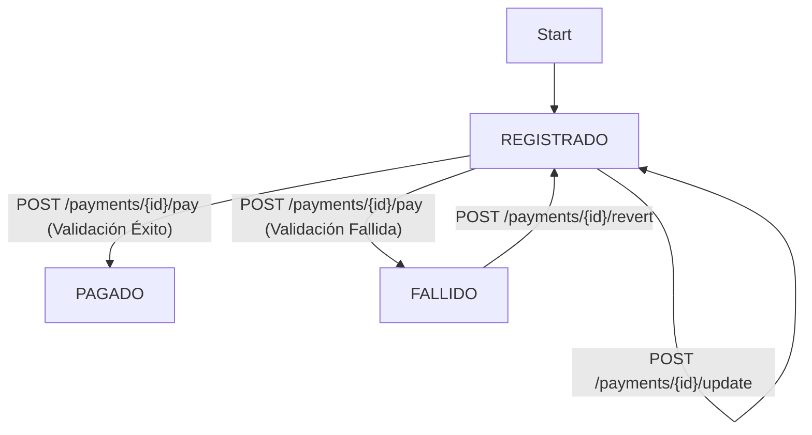
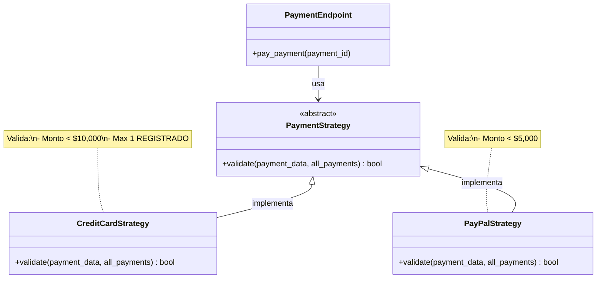

# API de Pagos - Examen Unidad 1

Implementación de una API de gestión de pagos en FastAPI, incluyendo tests, CI/CD y patrones de diseño.

## 1. API en Producción (Live Demo)

* **API Base URL:** `https://examen-mia203-grupo1.onrender.com`
* **Documentación (Swagger):** `https://examen-mia203-grupo1.onrender.com/docs`

---

## 2. Ejecución Local

**a. Instalar dependencias:**
```bash
pip install -r requirements.txt
```

**b. Correr la Aplicación**

Para iniciar el servidor en modo desarrollo (con auto-recarga):
```bash
uvicorn online_payments:app --reload
```

**c. Correr Tests**

Para ejecutar la suite de tests automáticos (usando `unittest`):
```bash
python -m unittest
```

## 3. Decisiones de Diseño y Trade-offs

### 3.1. Patrón Strategy (Validación de Pagos)

* **Decisión:** Se usó el Patrón **Strategy** para manejar las lógicas de validación (`PayPal` vs. `Tarjeta de Crédito`).
* **Implementación:** Se creó una interfaz `PaymentStrategy` y clases concretas (`CreditCardStrategy`, `PayPalStrategy`). Un diccionario selecciona la estrategia en tiempo de ejecución.
* **Trade-off:** Permite añadir nuevos métodos de pago (ej. "MercadoPago") sin modificar el *endpoint* `/pay` (cumpliendo el **Principio Abierto/Cerrado**. A cambio, añade más clases al proyectos.

### 3.2. Manejo de Estados ("State Guards")

* **Decisión:** **No** se implementó el Patrón **State** formal (con clases de estado) para `REGISTRADO`, `PAGADO` y `FALLIDO`[cite: 941, 942].
* **Implementación:** Se usaron "Guardias de Estado" (`if current_status != ...`) en los *endpoints* `/update`, `/revert` y `/pay`.
* **Trade-off:** Se priorizó la **simplicidad (Principio KISS)** sobre un patrón formal que habría sido excesivo. La lógica de transición está distribuida, lo cual no escalaría bien si los flujos de estado fuesen más complejos.

### 3.3. Framework de Testing

* **Decisión:** Se utilizó **`unittest`** (nativo de Python).
* **Trade-off:** No requiere dependencias externas. La función `setUp` se usó para limpiar `data.json` antes de cada test, garantizando la **independencia de los tests**.

### 3.4. Manejo de Errores de API

* **Decisión:** Usar **`HTTPException`** para comunicar errores al cliente.
* **Implementación:**
    * **`404 Not Found`**: Si el `payment_id` no existe.
    * **`400 Bad Request`**: Si una regla de negocio (Guardia de Estado) falla.

## 4. Diagrama de Transición de Estados

El flujo de vida de un pago sigue el siguiente diagrama de estados (Mermaid):



## 5. Suposiciones Asumidas

* **Regla Tarjeta de Crédito:** La regla "no haya más de 1 pago... en estado 'REGISTRADO'" se interpretó como que el conteo total de pagos `REGISTRADOS` de "Tarjeta de Crédito" (incluyendo el actual) debe ser $\le 1$ al momento de pagar.
* **Persistencia:** Se asume que `data.json` existe y la aplicación tiene permisos de Lectura/Escritura (R/W) sobre él.

## 6. CI/CD

* **Integración Continua (CI):** Se configuró **GitHub Actions** (`.github/workflows/ci_pipeline.yml`). Este flujo ejecuta automáticamente `python -m unittest` en cada PR a `main`, asegurando que el código que se fusione haya pasado los tests.
* **Entrega Continua (CD):** Se configuró un segundo *workflow* de GitHub Actions (`.github/workflows/cd_release.yml`) que se encarga de disparar un *Deploy Hook* de Render automáticamente cada vez que se hace `push` al *branch* `production`.

### Configuración del Secret para CD

Para que el deployment automático funcione, es necesario configurar el secret en GitHub:

1. Ir a **Settings → Secrets and variables → Actions** en el repositorio de GitHub
2. Crear un nuevo secret llamado `RENDER_DEPLOY_HOOK_URL`
3. Obtener el Deploy Hook URL desde el dashboard de Render (Settings → Deploy Hook)
4. Pegar la URL como valor del secret

Una vez configurado, cada push al branch `production` disparará automáticamente un deployment.

## 7. Diagrama del Patrón Strategy

El siguiente diagrama ilustra cómo se implementó el Patrón Strategy para las validaciones de pago:



**Beneficios del patrón:**
- Nuevos métodos de pago se pueden agregar sin modificar el endpoint `/pay`
- Cada estrategia encapsula su propia lógica de validación
- Fácil de testear cada validación de forma independiente

## 8. Estrategia de Testing

### Tipos de Tests Implementados

**Tests de funcionalidad básica (5 tests):**
- GET /payments con base vacía y con datos
- POST para registrar pagos
- Validaciones de errores 404 y 400

**Tests de validación de PayPal (2 tests):**
- Pago válido con monto < $5000 → PAGADO
- Pago inválido con monto ≥ $5000 → FALLIDO

**Tests de validación de Tarjeta de Crédito (3 tests):**
- Pago válido (< $10000 y único) → PAGADO
- Pago inválido por monto (≥ $10000) → FALLIDO
- Pago inválido por ya existir 1 REGISTRADO → FALLIDO

**Tests de flujo de estados (4 tests):**
- Update solo funciona en estado REGISTRADO
- Revert solo funciona en estado FALLIDO
- Pay solo funciona en estado REGISTRADO
- Pay con método desconocido da error

**Total: 14 tests** cubriendo casos normales, casos de error y validaciones de reglas de negocio.

### Independencia de Tests

Cada test usa `setUp()` para limpiar `data.json`, garantizando que:
- Los tests no tienen dependencias entre sí
- Se pueden ejecutar en cualquier orden
- Los resultados son reproducibles

## 10. Principios de Diseño Aplicados

### SOLID
- **Single Responsibility:** Cada clase tiene una responsabilidad única (ej: `CreditCardStrategy` solo valida tarjetas)
- **Open/Closed:** Se pueden agregar nuevos métodos de pago sin modificar código existente
- **Dependency Inversion:** El endpoint depende de la abstracción `PaymentStrategy`, no de implementaciones concretas

### Otros Principios
- **KISS (Keep It Simple):** Se evitó sobre-ingeniería (ej: no se usó Patrón State formal)
- **DRY (Don't Repeat Yourself):** Funciones helper reutilizables (`load_payment`, `save_payment`)
